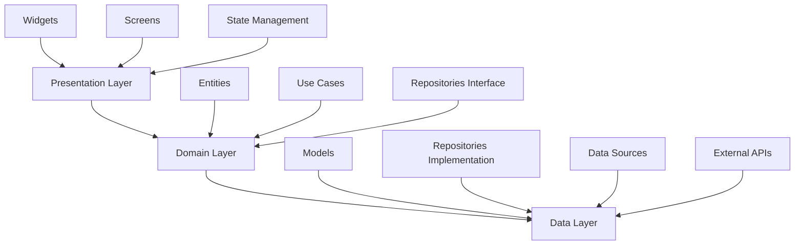

# Flutter App Architecture

Learn how to design scalable, maintainable Flutter applications using proven architectural patterns that work with any project structure.

> **Related Reading**: See [Project Structure](../setup/project-structure.md) for guidance on organizing your files and folders.

## Architecture Principles

### 1. Separation of Concerns

- **Presentation Layer**: Widgets, screens, and UI logic
- **Business Logic Layer**: State management, use cases, and business rules
- **Data Layer**: Repositories, data sources, and models
- **Core Layer**: Utilities, constants, and configuration

### 2. Dependency Inversion

- High-level modules should not depend on low-level modules
- Both should depend on abstractions
- Use dependency injection for better testability

### 3. Single Responsibility

- Each class should have one reason to change
- Widgets should focus on UI presentation
- Services should handle specific business logic

## Clean Architecture in Flutter



### Presentation Layer

**Responsibilities:**
- UI rendering and user interactions
- State management (UI state)
- Navigation handling
- Input validation and formatting

**Components:**
```dart
// Screens
class HomeScreen extends ConsumerWidget {
  @override
  Widget build(BuildContext context, WidgetRef ref) {
    final feedState = ref.watch(feedProvider);
    
    return Scaffold(
      body: feedState.when(
        data: (posts) => PostsList(posts: posts),
        loading: () => const LoadingIndicator(),
        error: (error, stack) => ErrorWidget(error),
      ),
    );
  }
}

// Widgets
class PostCard extends StatelessWidget {
  final Post post;
  
  const PostCard({required this.post});
  
  @override
  Widget build(BuildContext context) {
    return Card(
      child: Column(
        children: [
          PostHeader(user: post.user),
          PostImage(imageUrl: post.imageUrl),
          PostActions(post: post),
          PostCaption(caption: post.caption),
        ],
      ),
    );
  }
}
```

### Domain Layer

**Responsibilities:**
- Business logic and rules
- Entity definitions
- Use case implementations
- Repository interfaces

**Components:**
```dart
// Entities
class Post {
  final String id;
  final String userId;
  final String imageUrl;
  final String caption;
  final DateTime createdAt;
  final List<Like> likes;
  final List<Comment> comments;
  
  const Post({
    required this.id,
    required this.userId,
    required this.imageUrl,
    required this.caption,
    required this.createdAt,
    required this.likes,
    required this.comments,
  });
}

// Use Cases
class GetFeedUseCase {
  final PostRepository _repository;
  
  GetFeedUseCase(this._repository);
  
  Future<List<Post>> call(String userId) async {
    return await _repository.getFeed(userId);
  }
}

// Repository Interface
abstract class PostRepository {
  Future<List<Post>> getFeed(String userId);
  Future<Post> createPost(CreatePostRequest request);
  Future<void> likePost(String postId, String userId);
  Future<void> deletePost(String postId);
}
```

### Data Layer

**Responsibilities:**
- Data persistence and retrieval
- API communication
- Data transformation
- Caching strategies

**Components:**
```dart
// Repository Implementation
class PostRepositoryImpl implements PostRepository {
  final PostRemoteDataSource _remoteDataSource;
  final PostLocalDataSource _localDataSource;
  
  PostRepositoryImpl(this._remoteDataSource, this._localDataSource);
  
  @override
  Future<List<Post>> getFeed(String userId) async {
    try {
      final posts = await _remoteDataSource.getFeed(userId);
      await _localDataSource.cachePosts(posts);
      return posts.map((model) => model.toEntity()).toList();
    } catch (e) {
      // Fallback to cached data
      final cachedPosts = await _localDataSource.getCachedPosts();
      return cachedPosts.map((model) => model.toEntity()).toList();
    }
  }
}

// Data Sources
class PostRemoteDataSource {
  final SupabaseClient _client;
  
  PostRemoteDataSource(this._client);
  
  Future<List<PostModel>> getFeed(String userId) async {
    final response = await _client
        .from('posts')
        .select('*, users(*), likes(*), comments(*)')
        .order('created_at', ascending: false);
    
    return response.map((json) => PostModel.fromJson(json)).toList();
  }
}
```

## State Management Architecture

### Riverpod Pattern

```dart
// Providers
final postRepositoryProvider = Provider<PostRepository>((ref) {
  final remoteDataSource = ref.read(postRemoteDataSourceProvider);
  final localDataSource = ref.read(postLocalDataSourceProvider);
  return PostRepositoryImpl(remoteDataSource, localDataSource);
});

final getFeedUseCaseProvider = Provider<GetFeedUseCase>((ref) {
  final repository = ref.read(postRepositoryProvider);
  return GetFeedUseCase(repository);
});

final feedProvider = FutureProvider<List<Post>>((ref) async {
  final useCase = ref.read(getFeedUseCaseProvider);
  final user = ref.read(currentUserProvider);
  return await useCase(user.id);
});

// State Notifier for complex state
class FeedNotifier extends StateNotifier<AsyncValue<List<Post>>> {
  final GetFeedUseCase _getFeedUseCase;
  final CreatePostUseCase _createPostUseCase;
  
  FeedNotifier(this._getFeedUseCase, this._createPostUseCase) 
      : super(const AsyncValue.loading());
  
  Future<void> loadFeed(String userId) async {
    state = const AsyncValue.loading();
    try {
      final posts = await _getFeedUseCase(userId);
      state = AsyncValue.data(posts);
    } catch (error, stackTrace) {
      state = AsyncValue.error(error, stackTrace);
    }
  }
  
  Future<void> createPost(CreatePostRequest request) async {
    try {
      final newPost = await _createPostUseCase(request);
      state = state.whenData((posts) => [newPost, ...posts]);
    } catch (error) {
      // Handle error
    }
  }
}
```

### BLoC Pattern (Alternative)

```dart
// Events
abstract class FeedEvent {}
class LoadFeed extends FeedEvent {
  final String userId;
  LoadFeed(this.userId);
}

// States
abstract class FeedState {}
class FeedInitial extends FeedState {}
class FeedLoading extends FeedState {}
class FeedLoaded extends FeedState {
  final List<Post> posts;
  FeedLoaded(this.posts);
}
class FeedError extends FeedState {
  final String message;
  FeedError(this.message);
}

// BLoC
class FeedBloc extends Bloc<FeedEvent, FeedState> {
  final GetFeedUseCase _getFeedUseCase;
  
  FeedBloc(this._getFeedUseCase) : super(FeedInitial()) {
    on<LoadFeed>(_onLoadFeed);
  }
  
  Future<void> _onLoadFeed(LoadFeed event, Emitter<FeedState> emit) async {
    emit(FeedLoading());
    try {
      final posts = await _getFeedUseCase(event.userId);
      emit(FeedLoaded(posts));
    } catch (error) {
      emit(FeedError(error.toString()));
    }
  }
}
```

## Navigation Architecture

### Go Router Setup

```dart
// Route Configuration
final goRouter = GoRouter(
  initialLocation: '/splash',
  routes: [
    GoRoute(
      path: '/splash',
      builder: (context, state) => const SplashScreen(),
    ),
    GoRoute(
      path: '/auth',
      builder: (context, state) => const AuthScreen(),
      routes: [
        GoRoute(
          path: '/login',
          builder: (context, state) => const LoginScreen(),
        ),
        GoRoute(
          path: '/register',
          builder: (context, state) => const RegisterScreen(),
        ),
      ],
    ),
    ShellRoute(
      builder: (context, state, child) => MainShell(child: child),
      routes: [
        GoRoute(
          path: '/home',
          builder: (context, state) => const HomeScreen(),
        ),
        GoRoute(
          path: '/profile/:userId',
          builder: (context, state) => ProfileScreen(
            userId: state.pathParameters['userId']!,
          ),
        ),
      ],
    ),
  ],
  redirect: (context, state) {
    final isAuthenticated = /* check auth state */;
    final isOnAuthPage = state.location.startsWith('/auth');
    
    if (!isAuthenticated && !isOnAuthPage) {
      return '/auth/login';
    }
    if (isAuthenticated && isOnAuthPage) {
      return '/home';
    }
    return null;
  },
);
```

## Error Handling Architecture

### Centralized Error Handling

```dart
// Error Types
abstract class AppError {
  final String message;
  final String? code;
  
  const AppError(this.message, {this.code});
}

class NetworkError extends AppError {
  const NetworkError(String message) : super(message, code: 'NETWORK_ERROR');
}

class AuthenticationError extends AppError {
  const AuthenticationError(String message) : super(message, code: 'AUTH_ERROR');
}

// Error Handler
class ErrorHandler {
  static void handle(Object error, StackTrace stackTrace) {
    if (error is AppError) {
      _handleAppError(error);
    } else {
      _handleUnknownError(error, stackTrace);
    }
  }
  
  static void _handleAppError(AppError error) {
    // Log error
    logger.error(error.message, error: error);
    
    // Show user-friendly message
    switch (error.runtimeType) {
      case NetworkError:
        _showSnackBar('Network connection error');
        break;
      case AuthenticationError:
        _navigateToLogin();
        break;
      default:
        _showSnackBar(error.message);
    }
  }
}
```

## Testing Architecture

### Unit Tests

```dart
// Test Setup
void main() {
  group('GetFeedUseCase', () {
    late MockPostRepository mockRepository;
    late GetFeedUseCase useCase;
    
    setUp(() {
      mockRepository = MockPostRepository();
      useCase = GetFeedUseCase(mockRepository);
    });
    
    test('should return list of posts when repository call is successful', () async {
      // Arrange
      final posts = [Post(/* test data */)];
      when(mockRepository.getFeed(any)).thenAnswer((_) async => posts);
      
      // Act
      final result = await useCase('user123');
      
      // Assert
      expect(result, equals(posts));
      verify(mockRepository.getFeed('user123')).called(1);
    });
  });
}
```

### Widget Tests

```dart
void main() {
  group('PostCard', () {
    testWidgets('should display post information correctly', (tester) async {
      // Arrange
      final post = Post(/* test data */);
      
      // Act
      await tester.pumpWidget(
        MaterialApp(
          home: PostCard(post: post),
        ),
      );
      
      // Assert
      expect(find.text(post.caption), findsOneWidget);
      expect(find.byType(CachedNetworkImage), findsOneWidget);
    });
  });
}
```

## Performance Considerations

### 1. Widget Optimization

```dart
// Use const constructors
class PostCard extends StatelessWidget {
  const PostCard({super.key, required this.post});
  
  // Implement efficient build methods
  @override
  Widget build(BuildContext context) {
    return RepaintBoundary(
      child: Card(/* widget tree */),
    );
  }
}
```

### 2. State Management Optimization

```dart
// Use selective rebuilds
Consumer(
  builder: (context, ref, child) {
    final posts = ref.watch(feedProvider.select((state) => state.posts));
    return PostsList(posts: posts);
  },
)
```

### 3. Memory Management

```dart
// Dispose resources properly
class FeedScreen extends StatefulWidget {
  @override
  _FeedScreenState createState() => _FeedScreenState();
}

class _FeedScreenState extends State<FeedScreen> {
  late ScrollController _scrollController;
  
  @override
  void initState() {
    super.initState();
    _scrollController = ScrollController();
  }
  
  @override
  void dispose() {
    _scrollController.dispose();
    super.dispose();
  }
}
```

## Next Steps

1. **Choose your architecture pattern** based on project complexity
2. **Set up dependency injection** for better testability
3. **Implement error handling** throughout your app
4. **Write tests** for critical business logic
5. **Proceed to [State Management](state-management.md)**

---

**Pro Tip**: Start with a simple architecture and evolve it as your app grows. Clean architecture provides a solid foundation for scalable Flutter applications.
