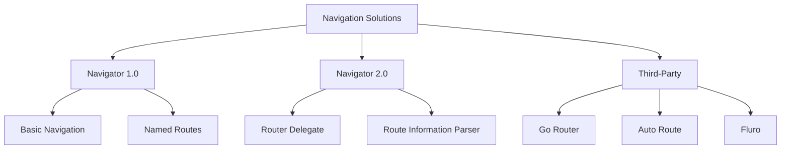

# Flutter Navigation

Comprehensive guide to navigation patterns in Flutter applications, covering different approaches and best practices for routing.

## Navigation Overview

Flutter offers multiple navigation solutions, each with different strengths and use cases.



## Decision Matrix

| App Complexity | Deep Linking | Web Support | Recommended Solution |
|----------------|--------------|-------------|---------------------|
| Simple | No | No | **Navigator 1.0** |
| Medium | Yes | Yes | **Go Router** |
| Complex | Yes | Yes | **Auto Route** |
| Enterprise | Yes | Yes | **Custom Router** |

## 1. Go Router (Recommended)

### Why Go Router?

- **Declarative routing**: Define routes in a clear, structured way
- **Deep linking**: Built-in support for URL-based navigation
- **Type safety**: Compile-time route validation
- **Web support**: Excellent web integration
- **Maintained by Flutter team**: Official support and updates

### Setup

```yaml
dependencies:
  go_router: ^12.0.0
```

### Basic Configuration

```dart
// routes.dart
final GoRouter router = GoRouter(
  initialLocation: '/splash',
  routes: [
    // Splash Screen
    GoRoute(
      path: '/splash',
      name: 'splash',
      builder: (context, state) => const SplashScreen(),
    ),
    
    // Authentication Routes
    GoRoute(
      path: '/auth',
      name: 'auth',
      builder: (context, state) => const AuthScreen(),
      routes: [
        GoRoute(
          path: '/login',
          name: 'login',
          builder: (context, state) => const LoginScreen(),
        ),
        GoRoute(
          path: '/register',
          name: 'register',
          builder: (context, state) => const RegisterScreen(),
        ),
        GoRoute(
          path: '/forgot-password',
          name: 'forgot-password',
          builder: (context, state) => const ForgotPasswordScreen(),
        ),
      ],
    ),
    
    // Main App Shell
    ShellRoute(
      builder: (context, state, child) => MainShell(child: child),
      routes: [
        GoRoute(
          path: '/home',
          name: 'home',
          builder: (context, state) => const HomeScreen(),
        ),
        GoRoute(
          path: '/search',
          name: 'search',
          builder: (context, state) => const SearchScreen(),
        ),
        GoRoute(
          path: '/profile/:userId',
          name: 'profile',
          builder: (context, state) => ProfileScreen(
            userId: state.pathParameters['userId']!,
          ),
        ),
        GoRoute(
          path: '/post/:postId',
          name: 'post',
          builder: (context, state) => PostDetailScreen(
            postId: state.pathParameters['postId']!,
          ),
        ),
      ],
    ),
    
    // Modal Routes
    GoRoute(
      path: '/create-post',
      name: 'create-post',
      pageBuilder: (context, state) => MaterialPage(
        fullscreenDialog: true,
        child: const CreatePostScreen(),
      ),
    ),
  ],
  
  // Redirect Logic
  redirect: (context, state) {
    final isAuthenticated = /* check auth state */;
    final isOnAuthPage = state.location.startsWith('/auth');
    final isOnSplash = state.location == '/splash';
    
    // Show splash screen first
    if (!isOnSplash && /* app is initializing */) {
      return '/splash';
    }
    
    // Redirect to login if not authenticated
    if (!isAuthenticated && !isOnAuthPage && !isOnSplash) {
      return '/auth/login';
    }
    
    // Redirect to home if authenticated and on auth page
    if (isAuthenticated && isOnAuthPage) {
      return '/home';
    }
    
    return null; // No redirect needed
  },
  
  // Error Handling
  errorBuilder: (context, state) => ErrorScreen(
    error: state.error.toString(),
  ),
);
```

### Navigation Usage

```dart
// Navigate to a route
context.go('/profile/user123');

// Navigate with named route
context.goNamed('profile', pathParameters: {'userId': 'user123'});

// Navigate with query parameters
context.goNamed(
  'search',
  queryParameters: {'query': 'flutter', 'category': 'posts'},
);

// Push a new route (keeps current route in stack)
context.push('/create-post');

// Pop current route
context.pop();

// Pop with result
context.pop('result_data');

// Replace current route
context.pushReplacement('/home');
```

### Type-Safe Navigation

```dart
// Define route data classes
class ProfileRoute {
  final String userId;
  final String? tab;
  
  ProfileRoute({required this.userId, this.tab});
  
  String get path => '/profile/$userId${tab != null ? '?tab=$tab' : ''}';
}

// Extension for type-safe navigation
extension AppNavigation on BuildContext {
  void goToProfile(String userId, {String? tab}) {
    final route = ProfileRoute(userId: userId, tab: tab);
    go(route.path);
  }
  
  void goToPost(String postId) {
    goNamed('post', pathParameters: {'postId': postId});
  }
  
  void goToCreatePost() {
    push('/create-post');
  }
}

// Usage
context.goToProfile('user123', tab: 'posts');
```

### Shell Routes for Bottom Navigation

```dart
class MainShell extends StatelessWidget {
  final Widget child;
  
  const MainShell({required this.child});
  
  @override
  Widget build(BuildContext context) {
    return Scaffold(
      body: child,
      bottomNavigationBar: BottomNavigationBar(
        currentIndex: _calculateSelectedIndex(context),
        onTap: (index) => _onItemTapped(index, context),
        type: BottomNavigationBarType.fixed,
        items: const [
          BottomNavigationBarItem(
            icon: Icon(Icons.home),
            label: 'Home',
          ),
          BottomNavigationBarItem(
            icon: Icon(Icons.search),
            label: 'Search',
          ),
          BottomNavigationBarItem(
            icon: Icon(Icons.add_box),
            label: 'Create',
          ),
          BottomNavigationBarItem(
            icon: Icon(Icons.favorite),
            label: 'Activity',
          ),
          BottomNavigationBarItem(
            icon: Icon(Icons.person),
            label: 'Profile',
          ),
        ],
      ),
    );
  }
  
  int _calculateSelectedIndex(BuildContext context) {
    final location = GoRouterState.of(context).location;
    if (location.startsWith('/home')) return 0;
    if (location.startsWith('/search')) return 1;
    if (location.startsWith('/activity')) return 3;
    if (location.startsWith('/profile')) return 4;
    return 0;
  }
  
  void _onItemTapped(int index, BuildContext context) {
    switch (index) {
      case 0:
        context.go('/home');
        break;
      case 1:
        context.go('/search');
        break;
      case 2:
        context.push('/create-post');
        break;
      case 3:
        context.go('/activity');
        break;
      case 4:
        final userId = /* get current user ID */;
        context.go('/profile/$userId');
        break;
    }
  }
}
```

## 2. Auto Route

### When to Use Auto Route

- **Code generation**: Automatic route generation
- **Type safety**: Compile-time route validation
- **Complex routing**: Advanced routing patterns
- **Large applications**: Better organization for big apps

### Setup

```yaml
dependencies:
  auto_route: ^7.8.0

dev_dependencies:
  auto_route_generator: ^7.3.0
  build_runner: ^2.4.0
```

### Route Configuration

```dart
// app_router.dart
@AutoRouterConfig()
class AppRouter extends _$AppRouter {
  @override
  List<AutoRoute> get routes => [
    // Splash
    AutoRoute(
      page: SplashRoute.page,
      path: '/splash',
      initial: true,
    ),
    
    // Auth Routes
    AutoRoute(
      page: AuthWrapperRoute.page,
      path: '/auth',
      children: [
        AutoRoute(page: LoginRoute.page, path: '/login'),
        AutoRoute(page: RegisterRoute.page, path: '/register'),
      ],
    ),
    
    // Main App
    AutoRoute(
      page: MainWrapperRoute.page,
      path: '/main',
      children: [
        AutoRoute(page: HomeRoute.page, path: '/home'),
        AutoRoute(page: SearchRoute.page, path: '/search'),
        AutoRoute(page: ProfileRoute.page, path: '/profile/:userId'),
      ],
    ),
    
    // Modal Routes
    AutoRoute(
      page: CreatePostRoute.page,
      path: '/create-post',
      fullscreenDialog: true,
    ),
  ];
}

// Generate routes
// Run: flutter packages pub run build_runner build
```

### Page Classes

```dart
// Define page classes
@RoutePage()
class SplashScreen extends StatelessWidget {
  @override
  Widget build(BuildContext context) {
    return const Scaffold(
      body: Center(child: CircularProgressIndicator()),
    );
  }
}

@RoutePage()
class ProfileScreen extends StatelessWidget {
  final String userId;
  
  const ProfileScreen({required this.userId});
  
  @override
  Widget build(BuildContext context) {
    return Scaffold(
      appBar: AppBar(title: Text('Profile: $userId')),
      body: /* profile content */,
    );
  }
}
```

### Navigation Usage

```dart
// Navigate using generated routes
context.router.push(ProfileRoute(userId: 'user123'));

// Navigate with replacement
context.router.pushAndClearStack(HomeRoute());

// Pop with result
context.router.pop('result');

// Navigate to nested route
context.router.pushPath('/main/profile/user123');
```

## 3. Navigator 1.0 (Basic)

### When to Use Navigator 1.0

- **Simple apps**: Basic navigation needs
- **Learning**: Understanding Flutter navigation fundamentals
- **Legacy projects**: Existing apps using Navigator 1.0

### Basic Navigation

```dart
// Push a new screen
Navigator.of(context).push(
  MaterialPageRoute(
    builder: (context) => const ProfileScreen(),
  ),
);

// Push with custom transition
Navigator.of(context).push(
  PageRouteBuilder(
    pageBuilder: (context, animation, secondaryAnimation) => const ProfileScreen(),
    transitionsBuilder: (context, animation, secondaryAnimation, child) {
      return SlideTransition(
        position: animation.drive(
          Tween(begin: const Offset(1.0, 0.0), end: Offset.zero),
        ),
        child: child,
      );
    },
  ),
);

// Pop current screen
Navigator.of(context).pop();

// Pop with result
Navigator.of(context).pop('result_data');

// Push and remove all previous routes
Navigator.of(context).pushAndRemoveUntil(
  MaterialPageRoute(builder: (context) => const HomeScreen()),
  (route) => false,
);
```

### Named Routes

```dart
// Define routes in MaterialApp
MaterialApp(
  routes: {
    '/': (context) => const HomeScreen(),
    '/profile': (context) => const ProfileScreen(),
    '/settings': (context) => const SettingsScreen(),
  },
  onGenerateRoute: (settings) {
    if (settings.name == '/profile') {
      final args = settings.arguments as Map<String, dynamic>?;
      return MaterialPageRoute(
        builder: (context) => ProfileScreen(
          userId: args?['userId'] ?? '',
        ),
      );
    }
    return null;
  },
);

// Navigate using named routes
Navigator.of(context).pushNamed('/profile', arguments: {'userId': 'user123'});
```

## Navigation Patterns

### 1. Authentication Flow

```dart
class AuthGuard {
  static String? redirect(BuildContext context, GoRouterState state) {
    final isAuthenticated = context.read<AuthProvider>().isAuthenticated;
    final isOnAuthPage = state.location.startsWith('/auth');
    
    if (!isAuthenticated && !isOnAuthPage) {
      return '/auth/login';
    }
    
    if (isAuthenticated && isOnAuthPage) {
      return '/home';
    }
    
    return null;
  }
}
```

### 2. Deep Linking

```dart
// Handle deep links
class DeepLinkHandler {
  static void handleDeepLink(String link) {
    final uri = Uri.parse(link);
    
    switch (uri.pathSegments.first) {
      case 'profile':
        if (uri.pathSegments.length > 1) {
          final userId = uri.pathSegments[1];
          router.go('/profile/$userId');
        }
        break;
      case 'post':
        if (uri.pathSegments.length > 1) {
          final postId = uri.pathSegments[1];
          router.go('/post/$postId');
        }
        break;
      default:
        router.go('/home');
    }
  }
}
```

### 3. Modal Navigation

```dart
// Show modal bottom sheet
void showCreatePostModal(BuildContext context) {
  showModalBottomSheet(
    context: context,
    isScrollControlled: true,
    backgroundColor: Colors.transparent,
    builder: (context) => DraggableScrollableSheet(
      initialChildSize: 0.9,
      builder: (context, scrollController) => Container(
        decoration: const BoxDecoration(
          color: Colors.white,
          borderRadius: BorderRadius.vertical(top: Radius.circular(20)),
        ),
        child: const CreatePostScreen(),
      ),
    ),
  );
}

// Show full-screen modal
void showFullScreenModal(BuildContext context) {
  Navigator.of(context).push(
    MaterialPageRoute(
      fullscreenDialog: true,
      builder: (context) => const CreatePostScreen(),
    ),
  );
}
```

## Performance Optimization

### 1. Lazy Loading

```dart
// Lazy load screens
GoRoute(
  path: '/heavy-screen',
  builder: (context, state) => FutureBuilder(
    future: _loadHeavyScreen(),
    builder: (context, snapshot) {
      if (snapshot.hasData) {
        return snapshot.data!;
      }
      return const LoadingScreen();
    },
  ),
);

Future<Widget> _loadHeavyScreen() async {
  // Load heavy dependencies
  await Future.delayed(const Duration(milliseconds: 500));
  return const HeavyScreen();
}
```

### 2. Route Caching

```dart
// Cache frequently used routes
class RouteCache {
  static final Map<String, Widget> _cache = {};
  
  static Widget getOrCreate(String key, Widget Function() builder) {
    if (!_cache.containsKey(key)) {
      _cache[key] = builder();
    }
    return _cache[key]!;
  }
  
  static void clear() {
    _cache.clear();
  }
}
```

## Testing Navigation

### Testing Go Router

```dart
void main() {
  group('Navigation Tests', () {
    testWidgets('should navigate to profile screen', (tester) async {
      final router = GoRouter(
        routes: [
          GoRoute(
            path: '/profile/:userId',
            builder: (context, state) => ProfileScreen(
              userId: state.pathParameters['userId']!,
            ),
          ),
        ],
      );
      
      await tester.pumpWidget(
        MaterialApp.router(
          routerConfig: router,
        ),
      );
      
      router.go('/profile/user123');
      await tester.pumpAndSettle();
      
      expect(find.byType(ProfileScreen), findsOneWidget);
    });
  });
}
```

## Best Practices

### 1. Route Organization

```dart
// Organize routes by feature
class AuthRoutes {
  static const login = '/auth/login';
  static const register = '/auth/register';
  static const forgotPassword = '/auth/forgot-password';
}

class MainRoutes {
  static const home = '/home';
  static const search = '/search';
  static String profile(String userId) => '/profile/$userId';
  static String post(String postId) => '/post/$postId';
}
```

### 2. Navigation Extensions

```dart
extension NavigationExtensions on BuildContext {
  void goToHome() => go(MainRoutes.home);
  void goToProfile(String userId) => go(MainRoutes.profile(userId));
  void goToPost(String postId) => go(MainRoutes.post(postId));
  
  Future<T?> showCreatePostModal<T>() {
    return showModalBottomSheet<T>(
      context: this,
      builder: (context) => const CreatePostModal(),
    );
  }
}
```

### 3. Error Handling

```dart
// Global error handling for navigation
class NavigationErrorHandler {
  static Widget handleError(BuildContext context, GoRouterState state) {
    return Scaffold(
      appBar: AppBar(title: const Text('Page Not Found')),
      body: Center(
        child: Column(
          mainAxisAlignment: MainAxisAlignment.center,
          children: [
            const Icon(Icons.error, size: 64),
            const SizedBox(height: 16),
            Text('Page "${state.location}" not found'),
            const SizedBox(height: 16),
            ElevatedButton(
              onPressed: () => context.go('/home'),
              child: const Text('Go Home'),
            ),
          ],
        ),
      ),
    );
  }
}
```

## Next Steps

1. **Choose your navigation solution** based on app complexity
2. **Set up deep linking** for better user experience
3. **Implement authentication guards** for protected routes
4. **Add proper error handling** for navigation failures
5. **Proceed to [Widget Design](widget-design.md)**

---

**Pro Tip**: Start with Go Router for most projects. It provides excellent developer experience and is maintained by the Flutter team.
