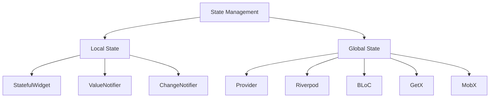

# Flutter State Management

Comprehensive guide to state management in Flutter applications, covering different patterns and when to use each approach.

## State Management Overview

State management is crucial for building scalable Flutter applications. The choice depends on your app's complexity, team size, and specific requirements.



## Decision Matrix

| App Complexity | Team Size | Learning Curve | Recommended Solution |
|----------------|-----------|----------------|---------------------|
| Simple | 1-2 devs | Easy | **Provider** |
| Medium | 2-5 devs | Medium | **Riverpod** |
| Complex | 5+ devs | Steep | **BLoC** |
| Rapid Prototype | Any | Easy | **GetX** |

## 1. Riverpod (Recommended)

### Why Riverpod?

- **Compile-time safety**: Catches errors at compile time
- **No BuildContext dependency**: Can be used anywhere
- **Better testing**: Easy to mock and test
- **Performance**: Automatic disposal and caching
- **Developer experience**: Excellent debugging tools

### Basic Setup

```yaml
dependencies:
  flutter_riverpod: ^2.4.0
  riverpod_annotation: ^2.3.0

dev_dependencies:
  riverpod_generator: ^2.3.0
  build_runner: ^2.4.0
```

### Provider Types

```dart
// Simple Provider
final counterProvider = StateProvider<int>((ref) => 0);

// Future Provider
final userProvider = FutureProvider<User>((ref) async {
  final api = ref.read(apiServiceProvider);
  return await api.getCurrentUser();
});

// Stream Provider
final postsStreamProvider = StreamProvider<List<Post>>((ref) {
  final api = ref.read(apiServiceProvider);
  return api.getPostsStream();
});

// StateNotifier Provider
final feedProvider = StateNotifierProvider<FeedNotifier, FeedState>((ref) {
  final repository = ref.read(postRepositoryProvider);
  return FeedNotifier(repository);
});
```

### StateNotifier Implementation

```dart
@freezed
class FeedState with _$FeedState {
  const factory FeedState({
    @Default([]) List<Post> posts,
    @Default(false) bool isLoading,
    String? error,
  }) = _FeedState;
}

class FeedNotifier extends StateNotifier<FeedState> {
  final PostRepository _repository;
  
  FeedNotifier(this._repository) : super(const FeedState());
  
  Future<void> loadPosts() async {
    state = state.copyWith(isLoading: true, error: null);
    
    try {
      final posts = await _repository.getPosts();
      state = state.copyWith(
        posts: posts,
        isLoading: false,
      );
    } catch (error) {
      state = state.copyWith(
        isLoading: false,
        error: error.toString(),
      );
    }
  }
  
  void addPost(Post post) {
    state = state.copyWith(
      posts: [post, ...state.posts],
    );
  }
  
  void removePost(String postId) {
    state = state.copyWith(
      posts: state.posts.where((post) => post.id != postId).toList(),
    );
  }
}
```

### Using Riverpod in Widgets

```dart
class FeedScreen extends ConsumerWidget {
  @override
  Widget build(BuildContext context, WidgetRef ref) {
    final feedState = ref.watch(feedProvider);
    
    return Scaffold(
      appBar: AppBar(title: const Text('Feed')),
      body: Column(
        children: [
          if (feedState.isLoading)
            const LinearProgressIndicator(),
          if (feedState.error != null)
            ErrorBanner(message: feedState.error!),
          Expanded(
            child: ListView.builder(
              itemCount: feedState.posts.length,
              itemBuilder: (context, index) {
                final post = feedState.posts[index];
                return PostCard(post: post);
              },
            ),
          ),
        ],
      ),
      floatingActionButton: FloatingActionButton(
        onPressed: () => ref.read(feedProvider.notifier).loadPosts(),
        child: const Icon(Icons.refresh),
      ),
    );
  }
}

// Consumer for specific parts
class PostCard extends ConsumerWidget {
  final Post post;
  
  const PostCard({required this.post});
  
  @override
  Widget build(BuildContext context, WidgetRef ref) {
    return Card(
      child: Column(
        children: [
          ListTile(
            title: Text(post.caption),
            trailing: Consumer(
              builder: (context, ref, child) {
                final isLiked = ref.watch(
                  likedPostsProvider.select((posts) => posts.contains(post.id))
                );
                
                return IconButton(
                  icon: Icon(
                    isLiked ? Icons.favorite : Icons.favorite_border,
                    color: isLiked ? Colors.red : null,
                  ),
                  onPressed: () {
                    ref.read(likedPostsProvider.notifier).toggle(post.id);
                  },
                );
              },
            ),
          ),
        ],
      ),
    );
  }
}
```

## 2. BLoC Pattern

### When to Use BLoC

- **Large teams**: Clear separation of concerns
- **Complex business logic**: Event-driven architecture
- **Testability**: Easy to test business logic
- **Predictable state**: Unidirectional data flow

### Setup

```yaml
dependencies:
  flutter_bloc: ^8.1.0
  equatable: ^2.0.0
```

### BLoC Implementation

```dart
// Events
abstract class FeedEvent extends Equatable {
  @override
  List<Object?> get props => [];
}

class LoadFeed extends FeedEvent {}

class AddPost extends FeedEvent {
  final Post post;
  
  AddPost(this.post);
  
  @override
  List<Object?> get props => [post];
}

class DeletePost extends FeedEvent {
  final String postId;
  
  DeletePost(this.postId);
  
  @override
  List<Object?> get props => [postId];
}

// States
abstract class FeedState extends Equatable {
  @override
  List<Object?> get props => [];
}

class FeedInitial extends FeedState {}

class FeedLoading extends FeedState {}

class FeedLoaded extends FeedState {
  final List<Post> posts;
  
  FeedLoaded(this.posts);
  
  @override
  List<Object?> get props => [posts];
}

class FeedError extends FeedState {
  final String message;
  
  FeedError(this.message);
  
  @override
  List<Object?> get props => [message];
}

// BLoC
class FeedBloc extends Bloc<FeedEvent, FeedState> {
  final PostRepository _repository;
  
  FeedBloc(this._repository) : super(FeedInitial()) {
    on<LoadFeed>(_onLoadFeed);
    on<AddPost>(_onAddPost);
    on<DeletePost>(_onDeletePost);
  }
  
  Future<void> _onLoadFeed(LoadFeed event, Emitter<FeedState> emit) async {
    emit(FeedLoading());
    
    try {
      final posts = await _repository.getPosts();
      emit(FeedLoaded(posts));
    } catch (error) {
      emit(FeedError(error.toString()));
    }
  }
  
  Future<void> _onAddPost(AddPost event, Emitter<FeedState> emit) async {
    if (state is FeedLoaded) {
      final currentState = state as FeedLoaded;
      emit(FeedLoaded([event.post, ...currentState.posts]));
    }
  }
  
  Future<void> _onDeletePost(DeletePost event, Emitter<FeedState> emit) async {
    if (state is FeedLoaded) {
      final currentState = state as FeedLoaded;
      final updatedPosts = currentState.posts
          .where((post) => post.id != event.postId)
          .toList();
      emit(FeedLoaded(updatedPosts));
    }
  }
}
```

### Using BLoC in Widgets

```dart
class FeedScreen extends StatelessWidget {
  @override
  Widget build(BuildContext context) {
    return BlocProvider(
      create: (context) => FeedBloc(
        context.read<PostRepository>(),
      )..add(LoadFeed()),
      child: const FeedView(),
    );
  }
}

class FeedView extends StatelessWidget {
  const FeedView();
  
  @override
  Widget build(BuildContext context) {
    return Scaffold(
      appBar: AppBar(title: const Text('Feed')),
      body: BlocBuilder<FeedBloc, FeedState>(
        builder: (context, state) {
          if (state is FeedLoading) {
            return const Center(child: CircularProgressIndicator());
          }
          
          if (state is FeedError) {
            return Center(
              child: Column(
                mainAxisAlignment: MainAxisAlignment.center,
                children: [
                  Text('Error: ${state.message}'),
                  ElevatedButton(
                    onPressed: () {
                      context.read<FeedBloc>().add(LoadFeed());
                    },
                    child: const Text('Retry'),
                  ),
                ],
              ),
            );
          }
          
          if (state is FeedLoaded) {
            return ListView.builder(
              itemCount: state.posts.length,
              itemBuilder: (context, index) {
                return PostCard(post: state.posts[index]);
              },
            );
          }
          
          return const SizedBox.shrink();
        },
      ),
      floatingActionButton: FloatingActionButton(
        onPressed: () {
          context.read<FeedBloc>().add(LoadFeed());
        },
        child: const Icon(Icons.refresh),
      ),
    );
  }
}
```

## 3. Provider Pattern

### When to Use Provider

- **Simple to medium apps**: Easy to learn and implement
- **Quick development**: Minimal boilerplate
- **Team familiarity**: Many developers know Provider

### Setup

```yaml
dependencies:
  provider: ^6.1.0
```

### ChangeNotifier Implementation

```dart
class FeedProvider extends ChangeNotifier {
  final PostRepository _repository;
  
  FeedProvider(this._repository);
  
  List<Post> _posts = [];
  bool _isLoading = false;
  String? _error;
  
  List<Post> get posts => _posts;
  bool get isLoading => _isLoading;
  String? get error => _error;
  
  Future<void> loadPosts() async {
    _isLoading = true;
    _error = null;
    notifyListeners();
    
    try {
      _posts = await _repository.getPosts();
      _isLoading = false;
      notifyListeners();
    } catch (error) {
      _isLoading = false;
      _error = error.toString();
      notifyListeners();
    }
  }
  
  void addPost(Post post) {
    _posts.insert(0, post);
    notifyListeners();
  }
  
  void removePost(String postId) {
    _posts.removeWhere((post) => post.id == postId);
    notifyListeners();
  }
}
```

### Using Provider in Widgets

```dart
class FeedScreen extends StatelessWidget {
  @override
  Widget build(BuildContext context) {
    return ChangeNotifierProvider(
      create: (context) => FeedProvider(
        context.read<PostRepository>(),
      )..loadPosts(),
      child: const FeedView(),
    );
  }
}

class FeedView extends StatelessWidget {
  const FeedView();
  
  @override
  Widget build(BuildContext context) {
    return Scaffold(
      appBar: AppBar(title: const Text('Feed')),
      body: Consumer<FeedProvider>(
        builder: (context, feedProvider, child) {
          if (feedProvider.isLoading) {
            return const Center(child: CircularProgressIndicator());
          }
          
          if (feedProvider.error != null) {
            return Center(
              child: Column(
                mainAxisAlignment: MainAxisAlignment.center,
                children: [
                  Text('Error: ${feedProvider.error}'),
                  ElevatedButton(
                    onPressed: () => feedProvider.loadPosts(),
                    child: const Text('Retry'),
                  ),
                ],
              ),
            );
          }
          
          return ListView.builder(
            itemCount: feedProvider.posts.length,
            itemBuilder: (context, index) {
              return PostCard(post: feedProvider.posts[index]);
            },
          );
        },
      ),
    );
  }
}
```

## Performance Optimization

### 1. Selective Rebuilds

```dart
// Riverpod - Use select for specific properties
Consumer(
  builder: (context, ref, child) {
    final postCount = ref.watch(
      feedProvider.select((state) => state.posts.length)
    );
    return Text('Posts: $postCount');
  },
)

// Provider - Use Selector
Selector<FeedProvider, int>(
  selector: (context, provider) => provider.posts.length,
  builder: (context, postCount, child) {
    return Text('Posts: $postCount');
  },
)
```

### 2. Avoid Unnecessary Rebuilds

```dart
// Use const constructors
class PostCard extends StatelessWidget {
  const PostCard({super.key, required this.post});
  
  final Post post;
  
  @override
  Widget build(BuildContext context) {
    return const Card(/* ... */);
  }
}

// Use RepaintBoundary for expensive widgets
RepaintBoundary(
  child: ExpensiveWidget(),
)
```

## Testing State Management

### Testing Riverpod

```dart
void main() {
  group('FeedNotifier', () {
    late MockPostRepository mockRepository;
    late ProviderContainer container;
    
    setUp(() {
      mockRepository = MockPostRepository();
      container = ProviderContainer(
        overrides: [
          postRepositoryProvider.overrideWithValue(mockRepository),
        ],
      );
    });
    
    tearDown(() {
      container.dispose();
    });
    
    test('should load posts successfully', () async {
      // Arrange
      final posts = [Post(/* test data */)];
      when(mockRepository.getPosts()).thenAnswer((_) async => posts);
      
      // Act
      await container.read(feedProvider.notifier).loadPosts();
      
      // Assert
      final state = container.read(feedProvider);
      expect(state.posts, equals(posts));
      expect(state.isLoading, false);
    });
  });
}
```

### Testing BLoC

```dart
void main() {
  group('FeedBloc', () {
    late MockPostRepository mockRepository;
    late FeedBloc feedBloc;
    
    setUp(() {
      mockRepository = MockPostRepository();
      feedBloc = FeedBloc(mockRepository);
    });
    
    tearDown(() {
      feedBloc.close();
    });
    
    blocTest<FeedBloc, FeedState>(
      'emits [FeedLoading, FeedLoaded] when LoadFeed is successful',
      build: () {
        when(mockRepository.getPosts()).thenAnswer((_) async => []);
        return feedBloc;
      },
      act: (bloc) => bloc.add(LoadFeed()),
      expect: () => [FeedLoading(), FeedLoaded([])],
    );
  });
}
```

## Best Practices

### 1. State Structure

```dart
// Good: Immutable state
@freezed
class AppState with _$AppState {
  const factory AppState({
    required User? user,
    required List<Post> posts,
    required bool isLoading,
  }) = _AppState;
}

// Avoid: Mutable state
class AppState {
  User? user;
  List<Post> posts = [];
  bool isLoading = false;
}
```

### 2. Error Handling

```dart
// Implement proper error types
abstract class AppError {
  final String message;
  const AppError(this.message);
}

class NetworkError extends AppError {
  const NetworkError(String message) : super(message);
}

class AuthError extends AppError {
  const AuthError(String message) : super(message);
}
```

### 3. Dependency Injection

```dart
// Use providers for dependency injection
final apiServiceProvider = Provider<ApiService>((ref) {
  return ApiService(baseUrl: 'https://api.example.com');
});

final postRepositoryProvider = Provider<PostRepository>((ref) {
  final apiService = ref.read(apiServiceProvider);
  return PostRepositoryImpl(apiService);
});
```

## Next Steps

1. **Choose your state management solution** based on project needs
2. **Set up proper testing** for your state management
3. **Implement error handling** patterns
4. **Optimize for performance** with selective rebuilds
5. **Proceed to [Navigation](navigation.md)**

---

**Pro Tip**: Start with Provider or Riverpod for most projects. Only use BLoC if you have complex business logic or large teams that benefit from strict patterns.
