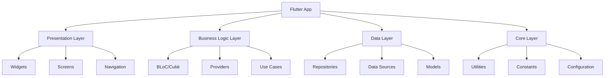
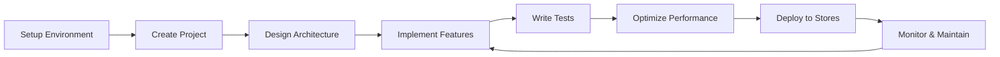

# Flutter Production-Grade Instagram Clone Guide

Welcome to the comprehensive guide for building production-grade Flutter applications. This documentation covers everything from setup to deployment, following industry best practices and Flutter-specific patterns.

## Overview

This guide is designed to take you from Flutter beginner to production-ready developer. Whether you're building your first mobile app or scaling an existing application, you'll find practical advice, best practices, and real-world examples.

## What You'll Learn

### Development Fundamentals

- Setting up a robust Flutter development environment
- Organizing scalable project structures with clean architecture
- Implementing effective state management patterns
- Managing dependencies and package integration

### Production Readiness

- Building secure authentication systems with Supabase
- Implementing proper error handling and monitoring
- Optimizing performance for mobile devices
- Setting up automated testing and deployment pipelines

### Advanced Topics

- Integrating platform-specific code and native features
- Implementing offline-first architectures
- Managing real-time data synchronization
- Deploying to app stores with confidence

## Architecture Overview

## Technology Stack

### Core Technologies

- **Flutter** 3.35+
- **Dart** 3.5+
- **Supabase** - Backend as a Service
- **Riverpod** - State management

### Recommended Packages

#### State Management

- **Riverpod** - Modern state management
- **flutter_bloc** - BLoC pattern implementation
- **provider** - Simple state management

#### UI & Styling

- **flutter_screenutil** - Screen adaptation
- **cached_network_image** - Image caching
- **flutter_svg** - SVG support
- **lottie** - Animations

#### Navigation

- **go_router** - Declarative routing
- **auto_route** - Code generation routing

#### Development Tools

- **flutter_lints** - Linting rules
- **build_runner** - Code generation
- **flutter_test** - Testing framework
- **integration_test** - Integration testing

## Quick Start Paths

### For Beginners

1. [Environment Setup](setup/environment-setup.md)
2. [Project Structure](setup/project-structure.md)
3. [Supabase Setup](setup/supabase-setup.md)
4. [Widget Design](architecture/widget-design.md)
5. [Styling Systems](ui/styling-systems.md)

### For Intermediate Developers

1. [App Architecture](architecture/app-architecture.md)
2. [State Management](architecture/state-management.md)
3. [API Integration](data/api-integration.md)
4. [Testing](tools/testing.md)

### For Advanced Developers

1. [Performance Optimization](tools/performance.md)
2. [Security Implementation](security/authentication.md)
3. [CI/CD Setup](deployment/cicd.md)
4. [Monitoring & Analytics](monitoring/crash-reporting.md)

## Development Workflow

## Prerequisites

Before diving into this guide, you should have:

- Basic knowledge of **Dart programming language**
- Understanding of **Flutter** fundamentals
- Familiarity with **mobile app concepts**
- A computer capable of running Flutter development tools

## Getting Help

- **Documentation**: Check the comprehensive guides in each section
- **GitHub Issues**: Report documentation bugs and improvements
- **Discussions**: Ask questions and get community support
- **Examples**: Check practical implementations in the project

## Contributing

This documentation is a living resource. Contributions are welcome:

1. **Report Issues**: Found something unclear or outdated?
2. **Suggest Improvements**: Have a better way to explain something?
3. **Add Examples**: Real-world examples are always valuable
4. **Share Best Practices**: Learned something new? Share it with the community

## License

This documentation is open source and available under the MIT License.

---

Ready to build amazing Flutter apps? Start with [Environment Setup](setup/environment-setup.md)!
